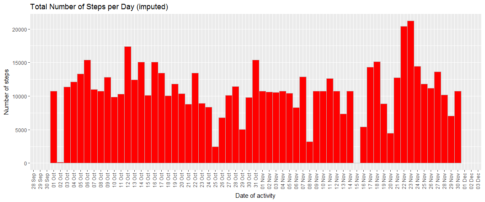

# Reproducible Research: Peer Assessment 1


## Loading and preprocessing the data
Start by unpacking the file from zip compression, followed by reading in the file using the *read.csv* command. In order for the data to be used in plotting colClasses must be specified so that the dates are read into the proper format.

```r
unzip(zipfile="activity.zip", overwrite = TRUE)
activity <- read.csv(file="activity.csv", colClasses = c("integer","Date","integer"))
```
  
Let's investigate the file contents and structure using *head* and *str*.

```r
head(activity)
```

```
##   steps       date interval
## 1    NA 2012-10-01        0
## 2    NA 2012-10-01        5
## 3    NA 2012-10-01       10
## 4    NA 2012-10-01       15
## 5    NA 2012-10-01       20
## 6    NA 2012-10-01       25
```

```r
str(activity)
```

```
## 'data.frame':	17568 obs. of  3 variables:
##  $ steps   : int  NA NA NA NA NA NA NA NA NA NA ...
##  $ date    : Date, format: "2012-10-01" "2012-10-01" ...
##  $ interval: int  0 5 10 15 20 25 30 35 40 45 ...
```


## What is mean total number of steps taken per day?

### 1. Calculate the total number of steps per day
To find the total steps per day *summarize* from dplyr package can be called on the dataset and specifying the summary function equal to *sum*.

```r
library(dplyr)
tsteps <- activity %>%
           group_by(date) %>%
           summarize(steps=sum(steps))
head(tsteps)
```

```
## # A tibble: 6 x 2
##         date steps
##       <date> <int>
## 1 2012-10-01    NA
## 2 2012-10-02   126
## 3 2012-10-03 11352
## 4 2012-10-04 12116
## 5 2012-10-05 13294
## 6 2012-10-06 15420
```


### 2. Generate a histogram of the total number of steps
From the ggplot2 library *geom_histogram* with *weight* aesthetic can be used to generate a suitable histogram.The x-scale labels needed to be formatted so show each day and then rotated 90 degrees to be legible. A warning will be generated for the "NA" values in steps.

```r
library(scales)
library(ggplot2)

ggplot(tsteps,aes(date, weight=steps))+geom_histogram(color="grey", fill="royalblue", binwidth=1)+
 xlab("Date of activity")+
 ylab("Number of steps")+
 theme(axis.text.x = element_text(angle = 90, hjust = 1, vjust= 0.4))+
 scale_x_date(breaks=date_breaks("1 day"), labels=date_format("%d %b"))+
 ggtitle("Total Number of Steps per Day")
```

<!-- -->


### 3. Calculate and report the mean and median of the total number of steps taken per day
Using *dplyr* and *summarize* to calculate aggregate statistics. We can only evaluate median where steps > 0

```r
library(reshape2)

agg <- activity%>%
  group_by(date)%>% 
  summarize(Steps.mean=mean(steps), Steps.median=median(steps[steps>0]))

agg_melt <- melt(agg, id=c("date"))

ggplot(agg_melt)+geom_line(aes(x=date, y=value, colour=variable), size=2 )+
  xlab("Date of activity")+
  ylab("Aggregate function of steps")+
  theme(axis.text.x = element_text(angle = 90, hjust = 1, vjust= 0.4))+
  scale_x_date(breaks=date_breaks("1 day"), labels=date_format("%d %b"))+
  ggtitle("Comparison of Mean/Median Steps per Day")
```

```
## Warning: Removed 4 rows containing missing values (geom_path).
```

<!-- -->


## What is the average daily activity pattern?
### 1. Make a time series plot (i.e. type = "l") of the 5-minute interval (x-axis) and the average number of steps taken, averaged across all days (y-axis)

```r
agg_timeseries <- aggregate(steps~interval, activity, mean)

plot(x=agg_timeseries$interval, y=agg_timeseries$steps, type="l", col="blue", 
     main="Time series of average steps per interval", ylab = "Average Steps",
      xlab = "Interval")

yval_maxsteps <- agg_timeseries$steps[which.max(agg_timeseries$steps)]
xval_associnterval <- agg_timeseries$interval[which.max(agg_timeseries$steps)]

text(x=xval_associnterval,y=yval_maxsteps,labels=paste(xval_associnterval,round(yval_maxsteps,2),sep=", "),pos=4,cex=0.7, col="red")
```

<!-- -->


### 2. Which 5-minute interval, on average across all the days in the dataset, contains the maximum number of steps?

A call to *which.max* on the y-value returns the row position of the coordinate pair that carries the information for determining the interval where the most averaged steps are taken.  
The maximum number of averaged steps occurs at interval **835** for a value of **206.1698113**. This has also been indicated in red in the time-series plot above. 

## Imputing missing values
### 1. Calculate and report the total number of missing values in the dataset (i.e. the total number of rows with NAs)


```r
NAobs <- activity[is.na(activity$steps),]
NAcount <- nrow(NAobs)
percNA <- round((NAcount / nrow(activity))*100,2)
```
By using *is.na* on the row index for the dataframe, the count of observations where steps are equal to NA can be calculated. The input dataset contains **2304** observations where the amount of steps are NA. Or put as a percentage **13.11%**.


### 2. Devise a strategy for filling in all of the missing values in the dataset. The strategy does not need to be sophisticated. For example, you could use the mean/median for that day, or the mean for that 5-minute interval, etc.
Since whole days are missing data it would be a better idea to use the intervals as basis for the imputed values. Following a mean approach to to replace NA values with calculated mean for that specific interval.


```r
impute_base <- aggregate(steps~interval, activity, mean)
nrow(impute_base)
```

```
## [1] 288
```

```r
length(unique(activity$interval))
```

```
## [1] 288
```

The amount of rows returned for impute_base is 288 and is consistent with the number of unique intervals in the original dataset. By using a mean summary over steps~interval would give successful replacement of all possible NA values.


### 3. Create a new dataset that is equal to the original dataset but with the missing data filled in.
Replacing only *NA* values where intervals variable is matched to the intervals variable in the *imputed_base* data.frame. *imputed_base* has summarized means by interval.  
Start by making a copy of the original dataset and then replacing the imputed values. Finally running head on all three data frames to show how the replacement worked.

```r
activity_impute <- activity

activity_impute[is.na(activity_impute$steps), "steps"] <- impute_base[impute_base$interval %in% activity_impute[is.na(activity_impute$steps), "interval"] , "steps"]

head(impute_base)
```

```
##   interval     steps
## 1        0 1.7169811
## 2        5 0.3396226
## 3       10 0.1320755
## 4       15 0.1509434
## 5       20 0.0754717
## 6       25 2.0943396
```

```r
head(activity)
```

```
##   steps       date interval
## 1    NA 2012-10-01        0
## 2    NA 2012-10-01        5
## 3    NA 2012-10-01       10
## 4    NA 2012-10-01       15
## 5    NA 2012-10-01       20
## 6    NA 2012-10-01       25
```

```r
head(activity_impute)
```

```
##       steps       date interval
## 1 1.7169811 2012-10-01        0
## 2 0.3396226 2012-10-01        5
## 3 0.1320755 2012-10-01       10
## 4 0.1509434 2012-10-01       15
## 5 0.0754717 2012-10-01       20
## 6 2.0943396 2012-10-01       25
```

### 4. Make a histogram of the total number of steps taken each day and Calculate and report the mean and median total number of steps taken per day. Do these values differ from the estimates from the first part of the assignment? What is the impact of imputing missing data on the estimates of the total daily number of steps?


```r
#Mean/Median imputed
agg_impute <- activity_impute%>%
  group_by(date)%>% 
  summarize(Steps.mean=mean(steps), Steps.median=median(steps[steps>0]))

agg_melt_impute <- melt(agg_impute, id=c("date"))

ggplot(agg_melt_impute)+geom_line(aes(x=date, y=value, colour=variable), size=2 )+
  xlab("Date of activity")+
  ylab("Aggregate function of steps")+
  theme(axis.text.x = element_text(angle = 90, hjust = 1, vjust= 0.4))+
  scale_x_date(breaks=date_breaks("1 day"), labels=date_format("%d %b"))+
  ggtitle("Comparison of Mean/Median Steps per Day (imputed)")
```

<!-- -->

```r
#Totaled daily steps
imputed_tsteps <- activity_impute %>%
           group_by(date) %>%
           summarize(steps=sum(steps))


ggplot(imputed_tsteps,aes(date, weight=steps))+geom_histogram(color="grey", fill="red", binwidth=1)+
 xlab("Date of activity")+
 ylab("Number of steps")+
 theme(axis.text.x = element_text(angle = 90, hjust = 1, vjust= 0.4))+
 scale_x_date(breaks=date_breaks("1 day"), labels=date_format("%d %b"))+
 ggtitle("Total Number of Steps per Day (imputed)")
```

<!-- -->
For my approach the imputed median/means plot will only be different for that the days that originally had *NA* values in the original plot. This is visible in the new plot and indicated by the non-broken plot lines.

There will be a small but noticeable difference in the total daily steps plot since some days that had *NA* values can now be plotted based on the imputed values for steps.


## Are there differences in activity patterns between weekdays and weekends?  
  
Yes there are differences as is visible from the plot below.  
  

### 1. Create a new factor variable in the dataset with two levels - "weekday" and "weekend" indicating whether a given date is a weekday or weekend day.

```r
activity$dayclass <- as.factor(ifelse(weekdays(activity$date) %in% c("Saturday","Sunday"),"Weekend","Weekday"))
```


### 2. Make a panel plot containing a time series plot (i.e. type = "l") of the 5-minute interval (x-axis) and the average number of steps taken, averaged across all weekday days or weekend days (y-axis).


```r
agg_timeseriesd <- aggregate(steps~interval+dayclass, activity, mean)

ggplot(agg_timeseriesd, aes(x=interval, y=steps, col=dayclass))+
  geom_line()+
  facet_wrap(~ dayclass, nrow=2)+
  ggtitle("Time series of average steps per interval")+
  xlab("Average Steps")+
  ylab("Interval")
```

<!-- -->


